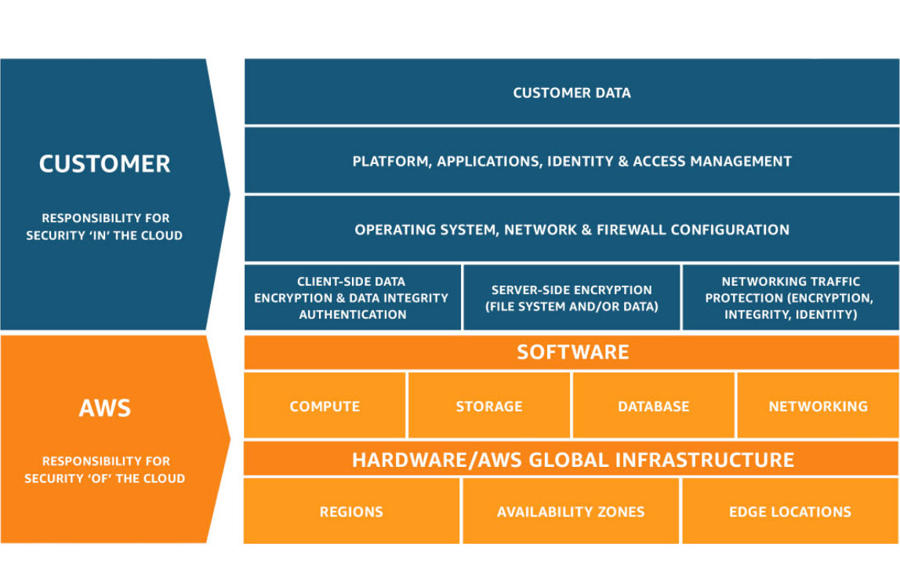

# Shared Responsibility Model

AWS follows a Shared Responsibility Model.

## AWS is responsible for:

(Security OF the Cloud)

* Physical security of data centers
* Hardware
* Networking infrastructure
* Global cloud infrastructure

## Customers are responsible for:

(Security IN the Cloud)

* Managing user access and permissions
* Protecting data
* Configuring services correctly
* Operating systems (in some services)
* Applications and customer content

## Key Idea

AWS secures the cloud infrastructure, while customers are responsible for securing what they put in the cloud.
